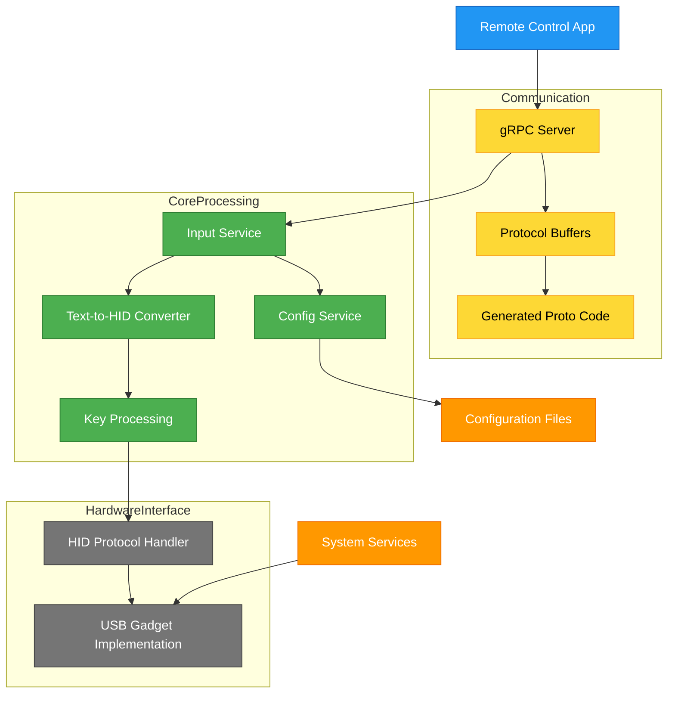

# Pi Remote

A gRPC-based keyboard & mouse gadget
for [remotecontrol-app](https://github.com/falleng0d/remotecontrol-app) on Pi Zero W

## Features

Basically this allows you to use a tablet or phone of your choice that has 
[remotecontrol-app](https://github.com/falleng0d/remotecontrol-app) installed to 
control another device (.e.g. a PC) as if the inputs are coming from a real 
keyboard and mouse. 

This is possible because the app sends the inputs to the **Rapsberry Pi Zero W**
, which then forwards them to the target device via an usb connection.

## Architecture


```mermaid
flowchart TB
    %% Styles and classes
    classDef client fill:#2196F3,stroke:#1565C0,color:white
    classDef grpc fill:#FDD835,stroke:#F9A825,color:black
    classDef core fill:#4CAF50,stroke:#2E7D32,color:white
    classDef hardware fill:#757575,stroke:#424242,color:white
    classDef config fill:#FF9800,stroke:#EF6C00,color:white

    %% Client Layer
    MobileApp["Remote Control App"]:::client

    %% Communication Layer
    subgraph Communication
        GRPC["gRPC Server"]:::grpc
        Proto["Protocol Buffers"]:::grpc
        ProtoGen["Generated Proto Code"]:::grpc
    end

    %% Core Processing Layer
    subgraph CoreProcessing
        InputSvc["Input Service"]:::core
        ConfigSvc["Config Service"]:::core
        TextHID["Text-to-HID Converter"]:::core
        KeyProc["Key Processing"]:::core
    end

    %% Hardware Interface Layer
    subgraph HardwareInterface
        HIDHandler["HID Protocol Handler"]:::hardware
        USBGadget["USB Gadget Implementation"]:::hardware
    end

    %% Configuration
    Config["Configuration Files"]:::config
    Services["System Services"]:::config

    %% Relationships
    MobileApp --> GRPC
    GRPC --> Proto
    Proto --> ProtoGen
    GRPC --> InputSvc
    InputSvc --> ConfigSvc
    ConfigSvc --> Config
    InputSvc --> TextHID
    TextHID --> KeyProc
    KeyProc --> HIDHandler
    HIDHandler --> USBGadget
    Services --> USBGadget

    %% Click events for component mapping
    click GRPC "https://github.com/falleng0d/pi-remote/blob/master/app/server.py"
    click Proto "https://github.com/falleng0d/pi-remote/blob/master/app/input.proto"
    click ProtoGen "https://github.com/falleng0d/pi-remote/blob/master/app/input_pb2.py"
    click InputSvc "https://github.com/falleng0d/pi-remote/blob/master/app/input_service.py"
    click ConfigSvc "https://github.com/falleng0d/pi-remote/blob/master/app/config_service.py"
    click TextHID "https://github.com/falleng0d/pi-remote/blob/master/app/text_to_hid.py"
    click HIDHandler "https://github.com/falleng0d/pi-remote/tree/master/app/hid"
    click USBGadget "https://github.com/falleng0d/pi-remote/tree/master/otg"
    click Services "https://github.com/falleng0d/pi-remote/blob/master/pi-remote.service"
    click Config "https://github.com/falleng0d/pi-remote/blob/master/remotecontrol.cfg"
    click KeyProc "https://github.com/falleng0d/pi-remote/blob/master/app/key.py"
```

## Output Backends

`output_backend = 'usb-gadget'` is the default and keeps the Raspberry Pi Zero USB HID behavior using `keyboard_path`, `mouse_path`, and `media_path`.

`output_backend = 'karabiner'` switches the same gRPC API to macOS input injection through a local helper process. For safety, when Karabiner is selected and `host` is still `0.0.0.0`, the server binds `127.0.0.1` unless `karabiner_allow_remote = True`; exposing input injection to a network is unsafe.

Example macOS config:

```python
output_backend = 'karabiner'
host = '127.0.0.1'
karabiner_helper_command = 'python3 helpers/karabiner-json-helper/karabiner_json_helper.py'
karabiner_device_hash = 0
karabiner_allow_remote = False
```

## macOS Karabiner Setup

1. Install Karabiner-Elements; it installs and manages [Karabiner-DriverKit-VirtualHIDDevice](https://github.com/pqrs-org/Karabiner-DriverKit-VirtualHIDDevice).
2. Do not start a second `Karabiner-VirtualHIDDevice-Daemon`; the Karabiner-Elements LaunchDaemon owns the fixed socket path.
3. Set `output_backend = 'karabiner'` and `karabiner_helper_command` in `remotecontrol.cfg`.
4. Run pi-remote locally and keep `host = '127.0.0.1'` unless you trust the network or have a separate authenticated tunnel. For LAN access, set `host = '0.0.0.0'` and `karabiner_allow_remote = True`.

The included `helpers/karabiner-json-helper/karabiner_json_helper.py` speaks Karabiner's root-only daemon protocol and injects keyboard, consumer/media, and pointing reports. The helper must run as root because the socket is under `/Library/Application Support/org.pqrs/tmp/rootonly`; run pi-remote as root or use a root-owned wrapper. Use `--dry-run` to validate the JSON-lines protocol without sending OS input.
