# Pi Remote

A gRPC-based keyboard & mouse gadget
for [remotecontrol-app](https://github.com/falleng0d/remotecontrol-app) on Pi Zero W

## Features

Basically this allows you to use a tablet or phone of your choice that has 
[remotecontrol-app](https://github.com/falleng0d/remotecontrol-app) installed to 
control another device (.e.g. a PC) as if the inputs are coming from a real 
keyboard and mouse. 

This is possible because the app sends the inputs to the **Rapsberry Pi Zero W**
, which then forwards them to the target device via an usb connection.

## Architecture

```mermaid
flowchart TB
    %% Styles and classes
    classDef client fill:#2196F3,stroke:#1565C0,color:white
    classDef grpc fill:#FDD835,stroke:#F9A825,color:black
    classDef core fill:#4CAF50,stroke:#2E7D32,color:white
    classDef hardware fill:#757575,stroke:#424242,color:white
    classDef config fill:#FF9800,stroke:#EF6C00,color:white

    %% Client Layer
    MobileApp["Remote Control App"]:::client

    %% Communication Layer
    subgraph Communication
        GRPC["gRPC Server"]:::grpc
        Proto["Protocol Buffers"]:::grpc
        ProtoGen["Generated Proto Code"]:::grpc
    end

    %% Core Processing Layer
    subgraph CoreProcessing
        InputSvc["Input Service"]:::core
        ConfigSvc["Config Service"]:::core
        TextHID["Text-to-HID Converter"]:::core
        KeyProc["Key Processing"]:::core
    end

    %% Hardware Interface Layer
    subgraph HardwareInterface
        HIDHandler["HID Protocol Handler"]:::hardware
        USBGadget["USB Gadget Implementation"]:::hardware
    end

    %% Configuration
    Config["Configuration Files"]:::config
    Services["System Services"]:::config

    %% Relationships
    MobileApp --> GRPC
    GRPC --> Proto
    Proto --> ProtoGen
    GRPC --> InputSvc
    InputSvc --> ConfigSvc
    ConfigSvc --> Config
    InputSvc --> TextHID
    TextHID --> KeyProc
    KeyProc --> HIDHandler
    HIDHandler --> USBGadget
    Services --> USBGadget

    %% Click events for component mapping
    click GRPC "https://github.com/falleng0d/pi-remote/blob/master/app/server.py"
    click Proto "https://github.com/falleng0d/pi-remote/blob/master/app/input.proto"
    click ProtoGen "https://github.com/falleng0d/pi-remote/blob/master/app/input_pb2.py"
    click InputSvc "https://github.com/falleng0d/pi-remote/blob/master/app/input_service.py"
    click ConfigSvc "https://github.com/falleng0d/pi-remote/blob/master/app/config_service.py"
    click TextHID "https://github.com/falleng0d/pi-remote/blob/master/app/text_to_hid.py"
    click HIDHandler "https://github.com/falleng0d/pi-remote/tree/master/app/hid"
    click USBGadget "https://github.com/falleng0d/pi-remote/tree/master/otg"
    click Services "https://github.com/falleng0d/pi-remote/blob/master/pi-remote.service"
    click Config "https://github.com/falleng0d/pi-remote/blob/master/remotecontrol.cfg"
    click KeyProc "https://github.com/falleng0d/pi-remote/blob/master/app/key.py"
```

